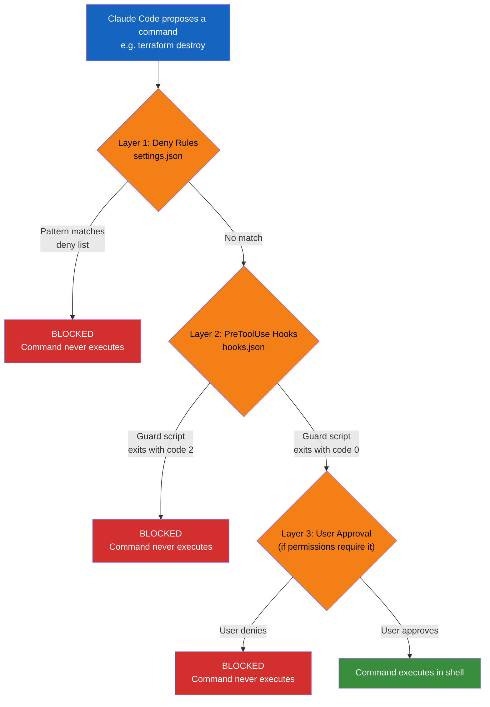

# Agent Guardrails

Hard policy enforcement for AI coding agents. Prevent destructive commands from ever being executed - regardless of what the agent proposes or what a human approves in the moment.

Built for [Claude Code](https://docs.anthropic.com/en/docs/claude-code), with patterns applicable to any AI agent that executes shell commands.

## Why this exists

AI coding agents are powerful but dangerous when given access to infrastructure tooling. A single `terraform destroy` or `DROP DATABASE` can wipe production in seconds. Human-in-the-loop approval is not sufficient - people approve destructive commands when they don't fully understand the scope.

This repo provides ready-to-use guardrails that **hard-block** dangerous commands at the tool level, before they ever reach a shell.

## Prerequisites

- [Claude Code](https://docs.anthropic.com/en/docs/claude-code) installed
- [jq](https://jqlang.github.io/jq/download/) installed (used by guard scripts to parse tool input)

## Install

Clone the repo:

```bash
git clone https://github.com/roboticforce/agent-guardrails.git
cd agent-guardrails
```

Then open Claude Code and paste the following prompt:

### Global install (all projects)

```
Install agent-guardrails globally from ./agent-guardrails (update the path to
wherever you cloned it). Read the settings.json, hooks.json, and all scripts
from the claude-code/ directory in the repo.

For settings.json: merge the permissions.deny array into my existing
~/.claude/settings.json without removing or overwriting any of my other
settings. If I don't have a settings.json yet, create one with just the
permissions block.

For hooks.json: copy to ~/.claude/hooks.json. Update all hook paths to use
absolute paths with $HOME/.claude/scripts/ so they work globally across all
projects. If I already have a hooks.json, merge the PreToolUse hooks into
my existing array.

For scripts: copy the scripts/ directory to ~/.claude/scripts/ and make
all .sh files executable.

After installing, verify by dry-running one guard script, e.g.:
echo '{"tool_input":{"command":"terraform destroy"}}' | ~/.claude/scripts/terraform-guard.sh
```

### Per-project install

```
Install agent-guardrails into this project from ~/dev/agent-guardrails (update
the path to wherever you cloned it). Read the settings.json, hooks.json, and
all scripts from the claude-code/ directory in the repo.

Copy settings.json to .claude/settings.json in this project.
Copy hooks.json to .claude/hooks.json in this project.
Copy the scripts/ directory to .claude/scripts/ in this project.
Make all .sh files executable.
Add .claude/scripts/ to .gitignore if it's not already there.

After installing, verify by dry-running one guard script, e.g.:
echo '{"tool_input":{"command":"terraform destroy"}}' | .claude/scripts/terraform-guard.sh
```

### Manual install (without Claude Code)

<details>
<summary>Click to expand</summary>

**Per-project:**

```bash
cp -r claude-code/.claude /path/to/your/project/
chmod +x /path/to/your/project/.claude/scripts/*.sh
```

**Global:**

> **Warning:** The `cp` commands below will overwrite existing files. If you
> already have a `~/.claude/settings.json` or `~/.claude/hooks.json`, back them
> up first and manually merge the JSON after copying.

```bash
# Back up existing config
cp ~/.claude/settings.json ~/.claude/settings.json.bak 2>/dev/null
cp ~/.claude/hooks.json ~/.claude/hooks.json.bak 2>/dev/null

# Copy files
cp claude-code/settings.json ~/.claude/settings.json
cp claude-code/hooks.json ~/.claude/hooks.json
cp -r claude-code/scripts ~/.claude/scripts
chmod +x ~/.claude/scripts/*.sh

# IMPORTANT: For global install, update hook paths in ~/.claude/hooks.json
# to use absolute paths. Replace all occurrences of:
#   .claude/scripts/
# with:
#   ~/.claude/scripts/
```

</details>

## What's included

### Deny rules (`settings.json`)

Pattern-based blocklist that prevents Claude Code from executing matching commands. These are **hard blocks** - the agent cannot execute them.

### Hook scripts

Bash scripts that run before every command execution. They inspect the command and block anything matching dangerous patterns. Exit code 2 = blocked with a message shown to the user.

| Script | What it blocks |
|--------|---------------|
| `terraform-guard.sh` | `destroy`, `apply -auto-approve`, state manipulation |
| `database-guard.sh` | `DROP DATABASE`, `DROP TABLE`, `TRUNCATE`, destructive migrations |
| `kubernetes-guard.sh` | `delete namespace`, `delete -f`, `drain --force` |
| `cloud-guard.sh` | Instance termination, resource deletion across AWS/GCP/Azure/DO |
| `git-guard.sh` | Force push to main/master/production, `reset --hard`, branch deletion |

### Policies

Documentation explaining what each guardrail protects against and why. Link these in onboarding docs so your team understands the reasoning.

## How it works

When Claude Code wants to run a shell command, it doesn't go straight to your terminal. The command passes through multiple enforcement layers before it can execute. If any layer rejects it, the command is killed and never reaches a shell.



### Layer 1: Deny rules (`settings.json`)

Pattern-based blocklist built into Claude Code's permission system. When a command matches a deny pattern, Claude Code **refuses to call the tool at all**. The agent cannot override this - it's enforced by the runtime, not the LLM.

```json
"Bash(command:terraform destroy*)"
"Bash(command:*DROP DATABASE*)"
"Bash(command:git push --force origin main*)"
```

### Layer 2: PreToolUse hooks (`hooks.json`)

Bash scripts that run **before** every Bash tool call. Claude Code pipes the full tool input (as JSON) into the script via stdin. The script inspects the command and decides:

- **Exit 0** - allow the command to proceed
- **Exit 2** - block the command and show the user why

This is more flexible than deny rules - scripts can use regex, check multiple patterns, and provide detailed error messages. Claude Code enforces the exit code. The agent cannot override a hook that returns exit code 2.

### Layer 3: CLAUDE.md instructions

Natural language instructions that tell the agent not to run destructive commands. This is the weakest layer - the agent follows instructions but could theoretically be prompted to ignore them. Never rely on this alone.

### Why all three?

| Layer | Mechanism | Bypassable from agent? |
|-------|-----------|----------------------|
| Deny rules | Pattern match on tool calls | No |
| Hooks (exit code 2) | Arbitrary script logic | No |
| `CLAUDE.md` instructions | LLM instruction following | Theoretically yes |

Defense in depth. Deny rules catch exact patterns. Hooks catch variations with regex. Instructions handle everything else. A destructive command has to get past all three layers to execute.

## Verifying your install

Test that the guardrails are working:

```bash
# Should print "BLOCKED" and exit with code 2
echo '{"tool_input":{"command":"terraform destroy"}}' | ~/.claude/scripts/terraform-guard.sh

# Should print "BLOCKED" and exit with code 2
echo '{"tool_input":{"command":"DROP DATABASE production"}}' | ~/.claude/scripts/database-guard.sh

# Should exit silently with code 0 (allowed)
echo '{"tool_input":{"command":"terraform plan"}}' | ~/.claude/scripts/terraform-guard.sh
```

## Uninstall

### Global

```bash
rm ~/.claude/hooks.json
rm -rf ~/.claude/scripts/
# Edit ~/.claude/settings.json and remove the "permissions" block
```

### Per-project

```bash
rm .claude/hooks.json
rm -rf .claude/scripts/
rm .claude/settings.json
```

## "I need to run a blocked command"

Run it manually in your terminal. These guardrails exist specifically to ensure a human directly executes and confirms destructive operations. The agent can help you prepare the command, review the plan, and explain what it will do - but the final execution should be yours.

There is no bypass mode by design. If an agent can be told to bypass a guardrail, the guardrail doesn't exist.

## Customizing

Every team has different infrastructure. Fork this repo and:

1. Edit `settings.json` to add/remove deny patterns for your stack
2. Modify hook scripts to match your specific commands and naming conventions
3. Add project-specific rules to your `CLAUDE.md`

## Real incidents

See `examples/incidents/` for real-world stories of AI agents destroying production infrastructure. Each incident includes what happened, what failed, and what guardrails would have prevented it.

## Learn from real failures

Practice responding to production incidents in a safe environment at [YouBrokeProd.com](https://youbrokeprod.com). Break things, fix things, get better - without the 3am pages.

## Need help with AI safety for your team?

Contact [RoboticForce, Inc.](https://roboticforce.io) for help implementing guardrails, policies, and safe AI agent workflows for your organization.

## License

MIT
